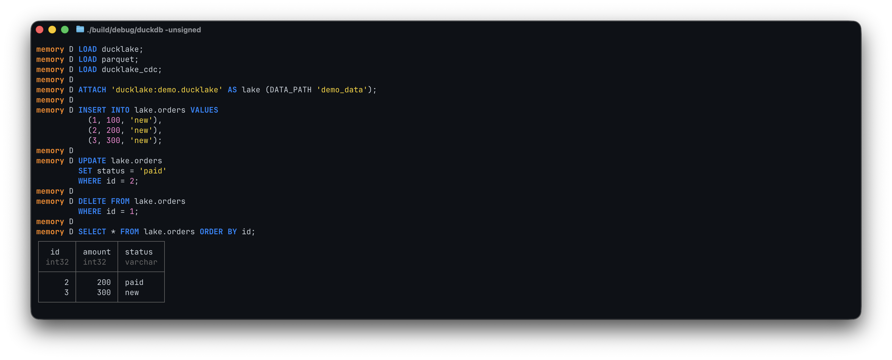
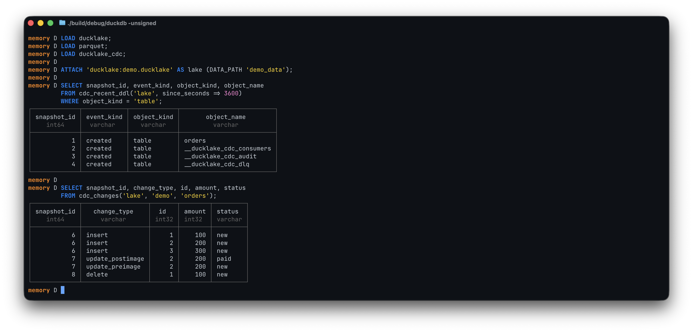

# ducklake-cdc

A DuckDB extension that adds a row-level change-data-capture cursor on top
of [DuckLake](https://ducklake.select).

> **Status: early community release (`v0.2.0`).** The SQL extension is
> published through DuckDB community extensions, and the core cursor / DDL /
> DML surface is usable today. Catalog coverage is smoke-tested across DuckDB,
> SQLite, and PostgreSQL, but this is still an early project: there are no
> language clients or reference sinks yet. See [`docs/roadmap.md`](./docs/roadmap.md)
> for direction and [`docs/hazard-log.md`](./docs/hazard-log.md) for known risks.

## What works today

- The cursor primitives — `cdc_window`, `cdc_commit`, `cdc_wait`,
  `cdc_ddl`, and the `cdc_consumer_*` lifecycle, all enforced by an
  owner-token lease for single-reader-per-consumer.
- Stateless sugar — `cdc_recent_changes`, `cdc_recent_ddl`,
  `cdc_schema_diff` — for ad-hoc exploration without creating a consumer.
- Composed sugar — `cdc_events`, `cdc_changes` — built over the
  primitives, applied with the consumer's `change_types` filter.
- Observability — `cdc_consumer_stats`, `cdc_audit_recent`.
- Structured errors and notices: `CDC_GAP`, `CDC_BUSY`,
  `CDC_INVALID_TABLE_FILTER`, `CDC_INCOMPATIBLE_CATALOG`,
  `CDC_SCHEMA_BOUNDARY`, `CDC_WAIT_TIMEOUT_CLAMPED`,
  `CDC_WAIT_SHARED_CONNECTION` — full list in
  [`docs/errors.md`](./docs/errors.md).
- Community-extension install: `INSTALL ducklake_cdc FROM community`.
- DuckDB, SQLite, and PostgreSQL DuckLake catalog smoke coverage in CI.
- Validated against DuckDB **v1.5.1** and the runtime-installed DuckLake
  extension (see [`docs/development.md`](./docs/development.md)).
- A bench smoke harness (`bench/runner.py` + `bench/light.yaml`) that
  reports end-to-end latency, throughput, catalog QPS, and lag drift.

## What does *not* work yet

- **No Python client yet.** The `import ducklake_cdc` snippet you may
  have seen in older drafts is roadmap material.
- **No reference sinks.** Stdout, file, webhook, Kafka, Redis Streams,
  and Postgres-mirror sinks are not shipped.
- **Backend coverage is smoke-level.** DuckDB, SQLite, and PostgreSQL
  catalog paths are exercised in CI, but not exhaustively certified.
- **No DLQ semantics.** The `__ducklake_cdc_dlq` table is created at
  bootstrap with the locked schema, but write/read/replay/acknowledge
  helpers and the DDL-blocks-DML policy are not shipped.
- **No `doctor` command.** Operational diagnostics are still manual SQL
  via `cdc_consumer_stats` and `cdc_audit_recent`.
- **Performance numbers are early signal.** The light benchmark harness
  exists, but published numbers are not production contracts.

## Build and run

You need a local clone with submodules and a working C++ toolchain:

```bash
git clone --recursive https://github.com/<this-repo>.git
cd ducklake-cdc-extension
make debug
./build/debug/duckdb -unsigned -c "SELECT cdc_version();"
```

The binary stamp is `git tag --points-at HEAD` if a tag points at the
build commit, otherwise the short SHA — so an unstable build reports
something like `ducklake_cdc 7a3b9c1`. Full build / test / sanitiser
guidance lives in [`docs/development.md`](./docs/development.md).

## Quickstart




```sql
-- Preconditions: DuckDB v1.5.1 and the official `ducklake`, `parquet`,
-- and `ducklake_cdc` extensions.
INSTALL ducklake;
INSTALL ducklake_cdc FROM community;
LOAD ducklake;
LOAD parquet;
LOAD ducklake_cdc;
ATTACH 'ducklake:my.ducklake' AS lake (DATA_PATH 'my_data');

CREATE TABLE lake.orders(id INTEGER, status VARCHAR);
INSERT INTO lake.orders VALUES (1, 'new');

SELECT * FROM cdc_consumer_create('lake', 'demo');
INSERT INTO lake.orders VALUES (2, 'paid');

-- The cursor loop in three primitives. cdc_window and cdc_commit are
-- table functions, and DuckDB table functions do not accept subqueries
-- as arguments, so capture end_snapshot into a session variable first.
SELECT * FROM cdc_window('lake', 'demo');                         -- acquire single-reader window
SELECT * FROM cdc_changes('lake', 'demo', 'orders');              -- typed DML rows for the window

SET VARIABLE end_snapshot = (
  SELECT end_snapshot FROM cdc_window('lake', 'demo')
);
SELECT * FROM cdc_commit('lake', 'demo', getvariable('end_snapshot'));
```

That is the durable cursor loop: create a named consumer, acquire a
single-reader window, read typed DML rows via the `cdc_changes` sugar
(or DuckLake's `lake.table_changes()` directly), then commit the
returned `end_snapshot`. Consumers that care about schema also call
`cdc_ddl('lake', 'demo')` between the window and the commit.

For ad-hoc exploration without a cursor, the stateless sugar:

```sql
SELECT * FROM cdc_recent_changes('lake', 'orders', since_seconds := 3600);
SELECT * FROM cdc_recent_ddl('lake', since_seconds := 86400);
SELECT * FROM cdc_schema_diff('lake', 'orders', /* from */ 0, /* to */ 5);
```

Long-poll consumers wrap the loop with `cdc_wait`. It is a table
function returning one BIGINT row (the new snapshot id, or NULL on
timeout), so always read it from a `FROM` clause:

```sql
SELECT * FROM cdc_wait('lake', 'demo', timeout_ms := 30000);
```

Operational dashboards read from `cdc_consumer_stats('lake')` (cursor /
gap / lease columns) and `cdc_audit_recent('lake')` (lifecycle audit
trail).

The full primitive + sugar surface, with row shapes and behaviour notes
per function, is in [`docs/api.md`](./docs/api.md). Known risks and sharp
edges are tracked in [`docs/hazard-log.md`](./docs/hazard-log.md).

## Examples

Runnable SQL examples ship under [`examples/`](./examples). Each one is a
self-contained script you can pipe into `./build/debug/duckdb`:

| File | Pattern |
| --- | --- |
| `01_basic_consumer.sql` | `cdc_window` + `table_changes` + `cdc_commit` directly |
| `02_outbox_demo.sql` | `cdc_events` dispatch on `commit_extra_info` |
| `03_long_poll.sql` | `cdc_wait` for a streaming consumer |
| `04_schema_change.sql` | `schema_changes_pending`, `cdc_ddl`, schema-boundary flow |
| `05_recent_changes.sql` | stateless `cdc_recent_changes` / `cdc_recent_ddl` |
| `06_parallel_readers.sql` | orchestrator + worker fan-out under one lease |
| `07_ddl_only_consumer.sql` | `event_categories := ['ddl']` schema-watcher |
| `08_cross_schema_window.sql` | `stop_at_schema_change := false` opt-out |
| `09_lease_recovery.sql` | force-release after a holder dies |

## Backends

DuckLake supports DuckDB, SQLite and PostgreSQL as metadata catalogs.
This extension has smoke coverage for all three catalog backends in CI.
Treat SQLite and PostgreSQL support as usable but young: the catalog matrix
currently proves the main cursor loop, schema-boundary path, and lease
rejection flow, not every SQLLogic edge case.

## Versioning and releases

The release flow is described in [`docs/design.md`](./docs/design.md).

Current community release line: `v0.2.0`.

## Where to go next

- **What this project intends to become** — [`VISION.md`](./VISION.md).
- **Roadmap** — [`docs/roadmap.md`](./docs/roadmap.md).
- **Design notes** — [`docs/design.md`](./docs/design.md).
- **Public API reference** — [`docs/api.md`](./docs/api.md).
- **Contributing** — [`CONTRIBUTING.md`](./CONTRIBUTING.md) and
  [`docs/development.md`](./docs/development.md).

## License

Apache-2.0 (see [`LICENSE`](./LICENSE)).
