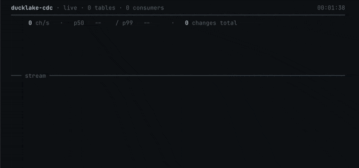

# ducklake-cdc

Turn DuckLake snapshots into durable change streams, so you can build realtime
sinks, cache invalidation, and lakehouse automation from plain DuckDB SQL.



> **Pre-alpha.** The current public API is in good shape, but names and row
> shapes may still change over the next 30 days.

## Who This Is For

`ducklake-cdc` is for DuckLake users who want to react to changes instead of
polling tables by hand.

Use it if you want to:

- Build downstream sinks from DuckLake tables.
- Invalidate caches when data or schemas change.
- Run lightweight lakehouse automation from SQL or Python.
- Keep durable consumer cursors without adding Kafka, Debezium, or a separate
  state store.
- Experiment with CDC workflows while staying inside DuckDB.

## What This Is Not

This is not trying to be a high-throughput streaming broker or an ultra-low
latency replication system.

If you need hundreds of thousands of events per second, or consistent sub-50ms
end-to-end latency, you probably want something built for that job.

## Use It From SQL

Create a durable DML consumer and read row changes:

```sql
SELECT *
FROM cdc_dml_consumer_create(
  'lake',
  'orders_sink',
  table_name := 'main.orders',
  change_types := ['insert', 'update_postimage', 'delete']
);

SELECT *
FROM cdc_dml_changes_read('lake', 'orders_sink');
```

Listen for schema changes:

```sql
SELECT *
FROM cdc_ddl_consumer_create('lake', 'schema_watch', schemas := ['main']);

SELECT *
FROM cdc_ddl_changes_listen('lake', 'schema_watch', timeout_ms := 30000);
```

## Learn More

- [SQL API](./docs/api.md)
- [Design notes](./docs/design.md)
- [Python client](https://pypi.org/project/ducklake-cdc-client/)
- [E2E benchmark](./e2e/benchmark/README.md)

Developer setup, builds, and tests live in [Development](./docs/development.md).
