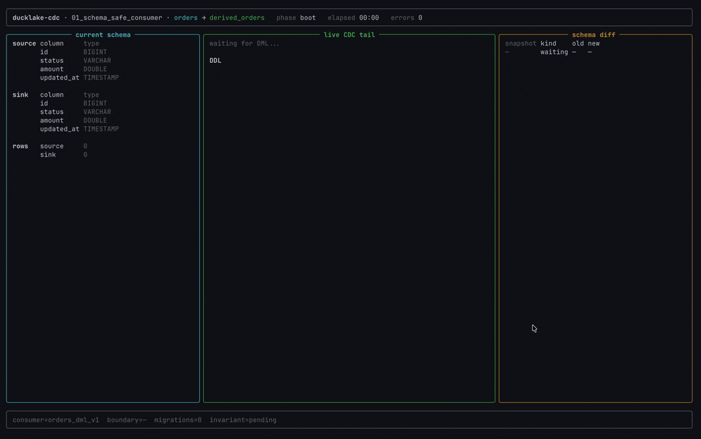

# 01 &mdash; Schema-Safe Consumer

This example shows how to consume DuckLake row changes without silently crossing
a table schema boundary.




## The Problem

You have a durable consumer applying `orders` changes into a derived table,
cache, index, or downstream service. The source table evolves while the consumer
is running:

```sql
ALTER TABLE lake.orders ADD COLUMN tax DOUBLE DEFAULT 0;
```

If the consumer keeps treating every row as the old shape, the sink can drift,
drop fields, or apply changes under the wrong schema contract.

## The Solution

A DML consumer is pinned to one schema shape. When `orders` changes, the current
consumer drains up to the schema boundary and stops. The app reads the DDL
event, asks the extension for a schema diff, migrates the sink, then starts a
successor consumer at the boundary snapshot.

In this demo, the source emits 40 DML events. Every 10 events it adds a column,
for 3 migrations total:

```text
orders_dml_v1 -> schema diff -> migrate sink -> orders_dml_v2
orders_dml_v2 -> schema diff -> migrate sink -> orders_dml_v3
orders_dml_v3 -> schema diff -> migrate sink -> orders_dml_v4
orders_dml_v4 -> final DML -> invariant check
```

## Run

```bash
docker compose -f e2e/docker-compose.yml up -d --wait
make release

# live TUI
uv run --project e2e python e2e/01_schema_safe_consumer/app.py

# unattended summary
uv run --project e2e python e2e/01_schema_safe_consumer/app.py --headless

# Postgres is the default; DuckDB also works for this single-process demo
uv run --project e2e python e2e/01_schema_safe_consumer/app.py --headless --catalog duckdb
```

The lake is reset before and after each run.

## What To Look For

- **Current schema** for `orders` and `derived_orders`.
- **Live DML tail** from the active consumer.
- **Schema diff** rows whenever the source shape changes.
- **Boundary messages** showing stop, migration, and resume.
- **Invariant status** proving the sink matches the source at the end.

Headless runs should finish with:

```text
phase=done
rows=40
migrations=3
invariant=ok
errors=0
```

## Python Client Bits

The example uses the high-level Python client for the schema-safe handoff:

```python
window = consumer.window()
diff = consumer.schema_diff()
next_consumer = consumer.successor("orders_dml_v2")
```

`consumer.successor(...)` reads the current consumer window and starts the next
consumer at `window.terminal_at_snapshot`. The app does not pass `start_at` in
the common path.

For DML application, batches still come from:

```python
consumer.client.cdc_dml_changes_listen(...)
consumer.client.cdc_commit(...)
```

The demo keeps the sink write and `cdc_commit` in one transaction so a replay
cannot duplicate committed sink rows.

## Extension APIs Underneath

- `cdc_dml_consumer_create`: creates each schema-pinned DML consumer.
- `cdc_dml_changes_listen`: returns DML rows for the current schema shape.
- `cdc_window`: reports the next window and the terminal schema boundary.
- `cdc_ddl_consumer_create`: watches DDL for the source table.
- `cdc_ddl_changes_listen`: returns the DDL event before post-DDL DML is applied.
- `cdc_schema_diff`: returns column-level changes for the boundary snapshot.
- `cdc_commit`: advances the consumer cursor after the sink write succeeds.

## Limitations

SQLite is intentionally not advertised for this demo. The sink write and
`cdc_commit` share one transaction to demonstrate the safe pattern, and the
SQLite catalog can surface `database is locked` during that flush path.
