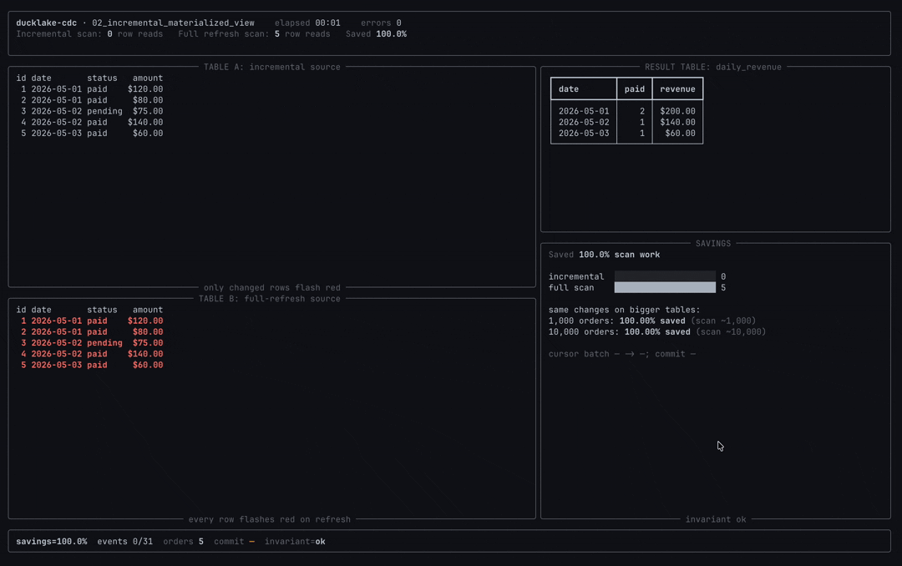

# 02 &mdash; Incremental Materialized View

This example keeps a derived DuckLake table current from CDC windows instead of
rescanning the source table after every change.




## The Problem

You have an `orders` table and a derived aggregate such as `daily_revenue`.
Refreshing that aggregate with:

```sql
SELECT order_date, count(*), sum(amount)
FROM lake.orders
WHERE status = 'paid'
GROUP BY order_date;
```

is simple, but it scans the source table every time. As `orders` grows, most
refresh work repeats rows that did not change.

## The Solution

A DML consumer reads only changed rows since its last committed snapshot. The
demo applies those changes as deltas:

- `insert`: add the row contribution.
- `delete`: subtract the row contribution.
- `update_preimage`: subtract the old contribution.
- `update_postimage`: add the new contribution.

The TUI keeps `lake.daily_revenue` in view while comparing the number of
incremental rows applied with the number of rows a full recompute would have
scanned.

```text
orders changes -> DMLConsumer -> delta math -> daily_revenue
orders table   -> full recompute check      -> invariant=ok
```

## Run

```bash
docker compose -f e2e/docker-compose.yml up -d --wait
make release

# live TUI
uv run --project e2e python e2e/02_incremental_materialized_view/app.py

# unattended summary
uv run --project e2e python e2e/02_incremental_materialized_view/app.py --headless

# DuckDB also works for this single-process demo
uv run --project e2e python e2e/02_incremental_materialized_view/app.py --headless --catalog duckdb
```

The lake is reset before and after each run.

## Scaling Note

Naive refresh rescans all of `orders` on every correctness check, so total
scan-rows grow with table size. The demo extrapolates: scaled naive scan ≈
`naive_scan_rows × (target_orders ÷ current_orders)`, while CDC row work stays
tied to the **same churn** (not to millions of untouched rows).

## What To Look For

- **Source activity** shows deterministic inserts, updates, and deletes.
- **Incremental `daily_revenue`** is the maintained aggregate table.
- **CDC window** shows the current snapshot window and committed cursor.
- **Correctness / cost** compares CDC rows to cumulative naive scan-rows, shows
  **% savings**, and extrapolates the same refresh cadence to **~10k** and
  **~1M** orders.

Headless runs should finish with:

```text
phase=done
...
savings=...
extrap_savings_10k=... extrap_savings_1m=...
```

`<total>` is the fixed scenario length (`EVENTS` in `app.py`, currently 31 steps after a short intro pause).

## Python Client Bits

The example uses the high-level Python consumer API:

```python
with DMLConsumer(lake, "daily_revenue_mv", table="orders", mode="changes") as consumer:
    batch = consumer.listen(...)
    with batch.transaction() as tx:
        apply_deltas(tx, batch.changes)
```

`DMLBatch.transaction()` keeps the aggregate update and `cdc_commit` in one
transaction, so replay cannot duplicate committed aggregate changes.

## Extension APIs Underneath

- `cdc_dml_consumer_create`: creates the durable consumer.
- `cdc_dml_changes_listen`: returns changed source rows for the next window.
- `cdc_commit`: advances the consumer cursor after the aggregate update commits.
- `cdc_window`: exposed by the client and useful for operational visibility.

## Limitations

SQLite is intentionally not advertised for this demo. The aggregate update and
`cdc_commit` share one transaction to demonstrate the safe pattern, and the
SQLite catalog can surface `database is locked` during that flush path. Use
Postgres when adapting the pattern to concurrent producers and consumers.
