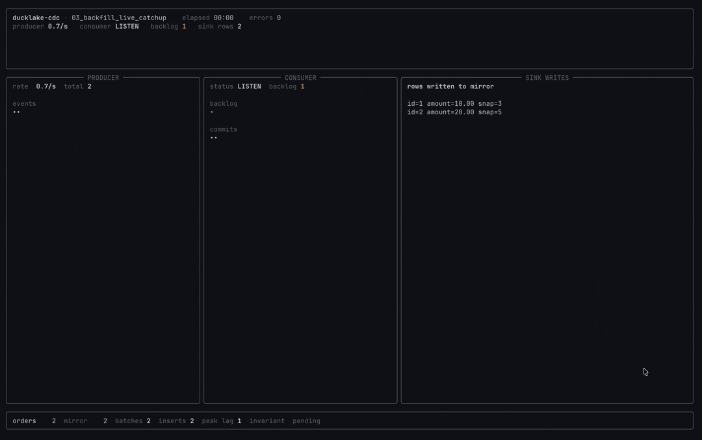

# 03 &mdash; Durable Catchup After Restarts

Keep mirrors, indexes, and serving tables alive through ordinary deploys and
process restarts. Producers keep writing, the durable cursor remembers the last
committed snapshot, and the consumer reopens to drain exactly the rows it missed.



## Python Client

```python
from ducklake_cdc_client import DMLConsumer


def apply(batch):
    with batch.transaction() as tx:
        mirror_orders(tx, batch.changes)


consumer = DMLConsumer(lake, "orders_mirror", table="orders", mode="changes").open()

for batch in consumer.batches(timeout_ms=1_000, max_snapshots=20, idle_timeout=1.0):
    apply(batch)

consumer.close()  # process restarts while producers keep writing

consumer = DMLConsumer(
    lake,
    "orders_mirror",
    table="orders",
    mode="changes",
    on_exists="use",
    lease_policy="takeover",
).open()

while batch := consumer.read(max_snapshots=50):
    apply(batch)

for batch in consumer.batches(timeout_ms=1_000, max_snapshots=20):
    apply(batch)
```

`batch.transaction()` applies sink writes and `cdc_commit` together. If the
consumer dies between batches, reopening the same name resumes from the last
committed snapshot instead of replaying the whole table.

## API References

- [`cdc_dml_consumer_create`](../../docs/api.md#cdc_dml_consumer_create): create or reopen the durable row-change cursor.
- [`cdc_dml_changes_listen`](../../docs/api.md#cdc_dml_changes_listen): long-poll new rows while the mirror is live.
- [`cdc_dml_changes_read`](../../docs/api.md#cdc_dml_changes_read): drain bounded backlog windows after downtime.
- [`cdc_commit`](../../docs/api.md#cdc_commit): advance the cursor after sink writes commit.
- [`cdc_window`](../../docs/api.md#cdc_window): inspect backlog and committed snapshot state.
