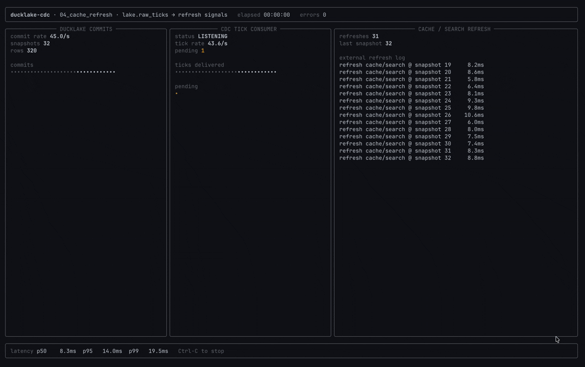

# 04 &mdash; Refresh Signals, Not Row Streams

Wake caches, search indexes, vector indexes, and service-local materializations
when DuckLake changes. Tick consumers carry snapshot metadata only: enough to
trigger a refresh, without shipping row payloads through the notification path.




## Python Client

```python
from ducklake_cdc_client import DMLConsumer


consumer = DMLConsumer(lake, "cache_refresh", table="orders", mode="ticks").open()

for batch in consumer.batches(timeout_ms=1_000, max_snapshots=100):
    for tick in batch:
        refresh_cache(snapshot_id=tick.snapshot_id)
        refresh_search_index(snapshot_id=tick.snapshot_id)

    batch.commit()
```

Use ticks when the downstream system can re-read what it needs from DuckLake.
The consumer commits only after every external refresh for the batch has been
scheduled or completed, so a restart resumes from the last acknowledged
snapshot.

## API References

- [`cdc_dml_consumer_create`](../../docs/api.md#cdc_dml_consumer_create): create the durable tick consumer with `mode='ticks'`.
- [`cdc_dml_ticks_listen`](../../docs/api.md#cdc_dml_ticks_listen): long-poll DML snapshot ticks without row payloads.
- [`cdc_dml_ticks_read`](../../docs/api.md#cdc_dml_ticks_read): drain pending tick windows without waiting.
- [`cdc_commit`](../../docs/api.md#cdc_commit): acknowledge refreshed snapshots.
- [`cdc_window`](../../docs/api.md#cdc_window): inspect pending snapshots and cursor state.
