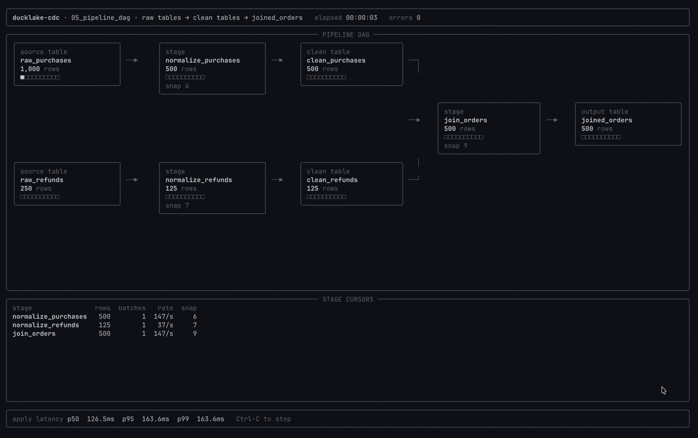

# 05 &mdash; Lakehouse DAGs Without Full Refreshes

Turn DuckLake tables into a live pipeline graph. Each stage reacts to upstream
changes, writes its derived table, and advances its own durable cursor only
after the output commit succeeds.



## Python Client

```python
from threading import Thread

from ducklake_cdc_client import DMLConsumer


def run_stage(name, source_table, apply_changes):
    consumer = DMLConsumer(lake, name, table=source_table, mode="changes").open()

    for batch in consumer.batches(timeout_ms=1_000, max_snapshots=100):
        with batch.transaction() as tx:
            apply_changes(tx, batch.changes)


Thread(
    target=run_stage,
    args=("normalize_purchases", "raw_purchases", write_clean_purchases),
).start()
Thread(
    target=run_stage,
    args=("normalize_refunds", "raw_refunds", write_clean_refunds),
).start()
Thread(
    target=run_stage,
    args=("join_orders", "clean_purchases", write_joined_orders),
).start()
```

Every node is isolated. If `join_orders` restarts, the normalize stages keep
their own cursors and the join resumes from its last committed snapshot.

## API References

- [`cdc_dml_consumer_create`](../../docs/api.md#cdc_dml_consumer_create): create one durable cursor per pipeline node.
- [`cdc_dml_changes_listen`](../../docs/api.md#cdc_dml_changes_listen): long-poll upstream changes for a node.
- [`cdc_commit`](../../docs/api.md#cdc_commit): advance the node after its derived table write commits.
- [`cdc_window`](../../docs/api.md#cdc_window): inspect a node's cursor and pending window.
